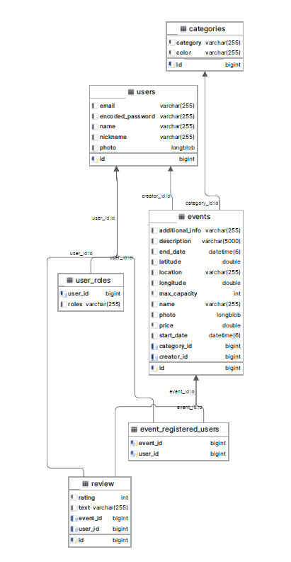
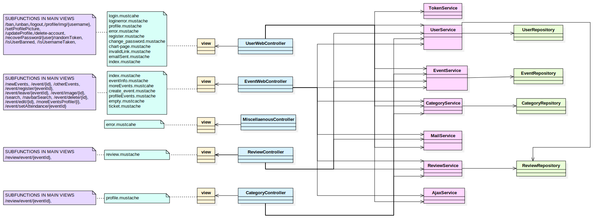

# webapp11

# <p align="center"> Events Crafters </p>
## 📑Index
- [Phase 0](phase-0)
   - [Team members](#team-members)
   - [Team organization](#team-organization)
   - [Entities](#entities)
   - [Types of users](#types-of-users)
   - [User requirements](#user-requirements)
   - [Charts](#charts)
   - [Advanced Algorithms](#advanced-algorithms)
   - [Optional features](#optional-features)

- [Phase 1](#phase-1)
   - [Screens](#screens)
      - [Home Screen](#home-screen)
      - [Login Screen](#login-screen)
      - [Profile Screen](#profile-screen)
      - [Event Info Screen](#event-info-screen)
      - [Change Password Screen](#change-password-screen)
      - [Create Account Screen](#create-account-screen)
      - [Create Review Screen](#create-review-screen)
      - [Create Event Screen](#create-event-screen)
   - [Screens Flow](#screens-flow)

 - [Phase 2](#phase-2)
   - [Execution instructions](#execution-instructions)
   - [Diagrams](#diagrams)  
   - [ScreenFlow](#sreenflow) 
   - [Possible actions to perform in the application](#possible-actions-to-perform-in-the-application)
   - [Recommendation algorithm](#recommendation-algorithm)
   - [Members Participation](#members-participation)
   - [Sample users](#sample-users)
***   
### ♨️Phase 0
***
 

## 👷Team members
| Name  | URJC Email| GitHub nickname |
| ------------- | ------------- | ----------- |
| Lucía Domínguez Rodrigo| l.dominguez.2021@alumnos.urjc.es | [@LuciaDominguezRodrigo](https://github.com/LuciaDominguezRodrigo) |
| Marcos Jiménez Pulido  | m.jimenezp.2021@alumnos.urjc.es  | [@MarJ03](https://github.com/MarJ03) |
| Tarek Elshami Ahmed | t.elshami.2021@alumnos.urjc.es  | [@TarekElshami](https://github.com/TarekElshami) |
| Álvaro Serrano Rodrigo | a.serranor.2021@alumnos.urjc.es  | [@AlvaroS3rrano](https://github.com/AlvaroS3rrano) |
| Ángel Marqués García | a.marquesg.2021@alumnos.urjc.es  | [@AngelMarquesGarcia](https://github.com/AngelMarquesGarcia) |

## 🧰Team organization

To help organize the team and keep track of tasks, we use [Trello](https://trello.com/invite/daw358/ATTIb7617ea77657d54f9a8a40ae8c00a941ADB6A0A5)

It is important to note that through this link, access will be granted to the workspace. There are multiple boards available. The phases developed within them are indicated with their own titles.

## 💻Entities
- Users
- Events
- Reviews
- Category
  
 The entities *user* and *event* will have **images** as attributes.
 
 The following diagram shows the system's entities, and how they relate to each other. It should be noted that, when there are M:N relationships, a new table is created to keep track of its instances, so the database will hold an extra table to keep track of the *Register* relationship shown below.
  ##### img: Entity-Relationship Diagram
  


## 🤖Types of users

 - **Anonymus** : users who have not logged into a registered account. They can access basic functionalities.
 - **Registered** :  users who have logged into a registered account. They can access a wide variety of funcionalities.
 - **Admin** :  type of user who has control over the platform, having the most extensive permissions.
   
## 🏁User requirements

| Requierement | Anonymus| Registered | Admin |
| ------------- | ------------- | ----------- | --------- |
|   View events  | <p align="center"> ☑️ </p> | <p align="center"> ☑️ </p> | <p align="center"> ☑️ </p>  |
|   View reviews  | <p align="center"> ☑️ </p> | <p align="center"> ☑️ </p>  | <p align="center"> ☑️ </p>  |
|   Create reviews  | | <p align="center"> ☑️ </p>  | |
|   Sign up to an event  | | <p align="center"> ☑️ </p>  | |
|   View event record  | | <p align="center"> ☑️ </p>  | |
|   Modify profile information  | | <p align="center"> ☑️ </p>  | |
|   Modify event information  | | <p align="center"> ☑️ </p>  | |
|   Delete published events  | | <p align="center"> ☑️ </p>  | |
|   View graphics  | | <p align="center"> ☑️ </p>  | <p align="center"> ☑️ </p>  |
|   Delete events (from other users)  | | | <p align="center"> ☑️ </p>  |
|   Block users  | | | <p align="center"> ☑️ </p>  |
|   Create/Modify tags  | | | <p align="center"> ☑️ </p>  |

## 🖱️ Additional Technologies
- **Send emails**: users will receive emails when signing up for a new event, and in some other cases.
- **Google Maps**: events will have a Google Maps embed showing the event location and its surroundings
  
## 📊Charts
- **Attendance chart**: users will be able to visualize an attendance chart for events they have published.
- **Categories chart**: users will be able to visualize a bar chart showing how many events there are for each tag

## 💡Advanced algorithms
- **Recommend by category**: This algorithm will choose the events to be featured in a registered user's home page based on the most common tags among events the user has attended.

## 🎯Optional features
-  **Sign-ups over time**: A chart displaying how many people have signed up for an event over time.
-  **Views chart**: A chart displaying the views an event has received over time.
-  **Filter by User Rating algorithm**: An algorithm that would promote events published by users whose previous events have been rated positively.
-  **PDF integration**: allow users to download a PDF holding event information upon sign-up.
-  **Chat**: give users the possibility of speaking to each other through the app, and/or create a chatroom for each event where users can discuss it.
***
### ♨️Phase 1
***

## 🖥️Screens

### 🏠Home Screen
This screen is where the users can find a list of upcoming events. The navbar contains two dropdown buttons and a search bar. One dropdown button will be used to filter by categories, and the other one to give the user access to more personalized screens (such as their profile). It's worth that all the displayed content is responsive, making it more accessible across different screens and devices


##### img 1: home screen


##### img 2: home screen - user dropdown botton


##### img 3: home screen - filter dropdown botton


### 🧑Login Screen
This is a simple screen containing a form that allows the user to log into their account.
##### img: Login Screen


### 💁Profile Screen
This screen has different functions depending on the type of user that accesses it (unregistered users don't have access to this screen).
- For Registered Users:
  - View the events that the user has created, recently joined, or already gone to.
  - Delete the user's account.
  - Modify the account's information.
Modify the account's information.
- For Administrators:
  - View all the events that the website has hosted or is currently hosting.
  - View all the event categories available for the users.
  - Create, update, delete event categories.
  - Delete events.

##### img 1: registered user profile screen part 1


##### img 2: registered user profile screen part 2


##### img 3: admin profile screen


##### img 4: update & create categories popup


### :information_source::ticket: Event Info Screen
This screen allows users to get detailed information of an event, as well as sign up for it if event tickets aren´t sold out yet. Specifically, this screen is made up of 5 large sections, which are:
- **Event information:** contains event main information (description, maximum capacity, price, date, hour, duration and additional relevant information about the event).
- **Tickets availability:** shows how fast tickets has been sold from a week ago to actual date, as well as available tickets amount and the different ticket options for the user to choose and buy.
- **Event placement:** contains the place where the event is held, as well as a map for easier placement.
- **Event host contact:** shows event host´s main information (name, nickname and photo). Also, this section includes a link to the host full profile information page.
- **Other events based on user´s preferences:** shows different events that the user would be interested in, based on the tags of the events the user recently signed up for.

##### img: Event Info Screen


### Change Password Screen
This is a simple screen containing a form that allows users to change their password. Only users who have logged in may access it. Alternatively, it could be accessed through one-time links.
##### img: Change Password Screen


### ✏️Create Account Screen
This is a simple screen containing a form that allows users to create a new account. It can only be accessed if the user is not currently logged in.
##### img: Create Account Screen


### 🖋️Create Review Screen
This is a simple screen containing a form that allows users to leave a review for an event they have attended. In order to be accessed, the user needs to have logged in, they need to have signed up for the event, and the event must be completed.
##### img: Review Screen


### ▶️Create Event Screen
This is a simple screen containing a form that allows users to create a new event. Only users who have logged in may access it.
##### img: Create Event Screen


## 🗺️Screens Flow
Upon entering the application, all users are presented with the Home screen.

- 🟦 For Unregistered Users:
  - From the Home screen, they can:
    - Register by clicking on the 'Register' button, leading them to the Register screen.
    - Log in by clicking on 'Log in', directing them to the Login screen.
    - View more details about events by clicking on 'See details' for an event, taking them to the Event Info screen.
  - From the Login screen, they can:
    - Navigate to 'Forgot my password' to reach the Change Password screen.

- 🔴 For Registered Users:
  - They can navigate to their Profile by clicking on 'My Profile' in the navigation bar, which takes them to the Profile screen.
  - On the Profile screen, users can:
    - Create new events by pressing the 'Create new event' button, leading to the Create Event screen.
    - View details of events from both the Profile and Home screens.
    - Make a review of an event by clicking on 'Rate' on the Profile screen, which leads to the Review screen.

- 🟪 For Administrators:
   - View details of events from the Home screen by clicking on 'See details', similar to unregistered and registered users.
   - Access their Admin Profile by clicking on 'My Profile' in the navigation bar from the Home screen, which allows them to manage active events, registered users, and the various available categories.
   - Navigate to the Category screen to create new categories.

##### img: Screens flow


***   
### ♨️Phase 2  - Web with server-generated HTML and AJAX
***

## 🔣Execution instructions

### 👟Steps 
1. Download this repository
2. Check Requirements 
3. Configure DataBase
4. Configure IDE
5. Run Application in the IDE
6. Go to https://localhost/8443/

### 📋Requirements
- Java: JDK 17 --> https://www.oracle.com/java/technologies/javase/jdk17-archive-downloads.html
- MySQL: v.8.0.36.0 (Explained in DataBase Configuration)
- Maven: 4.0.0
- Spring Boot 2.4.2
- IDE (explained in IDE Configuration)

### 💾DataBase Config
- Download MySQL v.8.0.36.0
- Select default port (port 3306)
- Create a user with name root and password "password" with DB admin as user role
- Configure MySQL Server as Windows Service
- Grant full access to the user
- Create a new Schema named EventCrafters in the server using MySQL Workbench

### 🕹️IDE Config
- We have used IntelliJ IDEA, bt it can be possible to use other IDE´S
- Install Maven and Spring for your IDE

## 🗃️Diagrams

### 💽DataBase diagram


*DataBase Diagram*

### 🏠Clases and templates diagram

*Clases and templates Diagram*

## 🌐ScreenFlow

*Screen Flow*

## 🧭 Possible actions to perform in the application
### Login
 To log in, access the screen that displays the corresponding form (/login). Enter the username and password, and you will be redirected to the personalized home page (since the session has been added).

### Recover password 
In the login form, there is an option to recover the password. You click on the link, and an email will be sent to the email associated with your username.

### Register
Through the login screen (via the "Sign Up" link) or the registration button on the default home screen, access will be provided to a user creation form. It's worth noting that all users will have the role of "user," with only one admin (created by the implementers themselves).

### Change profile photo
On the profile page, users are given the option to change their profile picture using a button identified by a camera icon. It should be noted that the page needs to be reloaded for the new profile picture to be updated.

### Update profile info
On the profile page, you can change the information by clicking on the "Editar Perfil" button. A form will appear where the user can update their data. It's worth noting that if any of the necessary login information has been changed, the user will be redirected to the login page to access with the new credentials. It should be noted that the admin will not be given the option to change their data.

### Ban/Unban
Similarly, the administrator will have access to these functions on the profile screen. It should be noted that these options will be exclusive to the administrator.

### Create event
This function will be accessible on the profile screen. In the "Mis eventos creados" section, the user should click on the button with the "+" symbol, which will redirect them to a form where they can enter event details.

### Edit/Delete Event
When accessing the event information screen, in the "Detalles del evento" section, if the user is the creator or an admin, they will be given the option to edit/delete the event through the "Editar evento"/ "Borrar evento" button.

### View Event Details
To see the details of an event, you need to click on the "View Details" button located on the event card itself. This action will take you to a page where all the specific information about the event is displayed, including date, time, location, description, and any other relevant details.

### Make a Review
Once you have signed up for an event and it has ended, if you enter it, you will see the option to leave a review in "Retroalimentación" section.

### Join/ Unregister an Event 
If you enter an event that is not finished and you're not already signed up, you click on the "Apuntarse" button to register for the event. In the same way, if ypu have joined an event, you can unregistered by clicking on "Desapuntarse", in the same section that "Apuntarse" button.

### Ticket
If you want to generate your event ticket, you should go to the event information page for the event you've signed up for, and click on "Ticket"

### Attendance chart
Once the event is concluded, if the user is the creator or an administrator, they should enter the number of attendees in the event information screen. After providing this information, a chart representing the percentage of attendance to the event will be displayed.

### Filter Events by Category
In the navigation bar of the home screen, there is a "Filter Events" button. Clicking on this button opens a dropdown menu where you can select from all available categories to filter the events accordingly.

### Search for Events
Also located in the navigation bar, the event search functionality allows you to type a keyword present in the name of an event and press the search button to find matching events.

### Create Categories
If you are an admin, upon entering your profile, you will find a button with a "+" symbol in the "Tags" section. Clicking on this button will prompt a pop-up where you can fill in the details for a new category and save it.

### Edit/Delete a Category
Within the same "Tags" section, you can view the details of a category by clicking on it. In the pop-up, you can modify the data and save the changes. If you wish to delete the category, press the trash bin symbol button in the pop-up and confirm your action.

### Delete Account
Non-admin users can delete their accounts by accessing their profile and clicking on the "Delete Account" button in red.

### View Your Events
In your profile screen, there are four sections separated for events you have created and have not yet ended, events you have created that have ended, events you have signed up for and have not yet ended, and events you have signed up for that have ended.

### Log Out
You can log out by clicking on the profile bar on the person icon and selecting "Log Out" in the dropdown menu.

## 🚀 Recommendation algorithm
An event recommendation algorithm has been implemented. It consists of two main parts:

 - **Unregistered user**: On the main screen, they will see the most popular events (popular being defined as those with the highest number of sign-ups).

 - **Registered user**: On the main screen, they will receive event recommendations based on their favorite category (the category to which the majority of events they have signed up for belong).

## ⚙️Members Participation

### 👩‍🔧Lucía Domínguez Rodrigo

| Commit | Description |
| :----: | :---------: |
| [1º](https://github.com/CodeURJC-DAW-2023-24/webapp11/commit/226ef18e81bf9cb71bb94c7983a8ad7ee3b60e0f) | Creation of function and form for updating profile |
| [2º](https://github.com/CodeURJC-DAW-2023-24/webapp11/commit/12a31ce8fe58129ddbb61d5fd132e9e33eea812e) | Registration created |
| [3º](https://github.com/CodeURJC-DAW-2023-24/webapp11/commit/b6514421d7e1f4871e44ea3c072c21e6c850611e) | Creation of function for deleting user|
| [4º](https://github.com/CodeURJC-DAW-2023-24/webapp11/commit/cdd8d0ca50112f13dec92a6d25a7cd44be314f71#diff-ac9d3bdeb47b0ea0b9031b88d650f2b8de0210593e1dfef2000df9749f92fe85) | Updating ban/unban function |
| [5º](https://github.com/CodeURJC-DAW-2023-24/webapp11/commit/fb74dd95bb074b7392f9551e26b1e0b1d400ce1c) | Creation of Models |

| File | Description |
| :----: | :---------: |
| [1º](Phase2/EventCrafters/src/main/java/com/EventCrafters/EventCrafters/controller/UserWebController.java) | User Web controller |
| [2º](Phase2/EventCrafters/src/main/java/com/EventCrafters/EventCrafters/model/User.java) | User Model, and definition in the DataBase |
| [3º](Phase2/EventCrafters/src/main/java/com/EventCrafters/EventCrafters/service/UserService.java) | User service |
| [4º](Phase2/EventCrafters/src/main/resources/templates/profile.mustache) | Profile mustache |
| [5º](Phase2/EventCrafters/src/main/resources/static/js/profile.js) | Functions related to user |

### 👨‍🔧 Ángel Marqués García

| Commit | Description |
| :----: | :---------: |
| [1º](https://github.com/CodeURJC-DAW-2023-24/webapp11/commit/744521f412b9c9630ebb39b6d11b2ffe919ac03e) | Started Phase 2 |
| [2º](https://github.com/CodeURJC-DAW-2023-24/webapp11/commit/963814930c9f9342366b02f9a88ee66b488e9383) | Modified register. Can't create account with existing username |
| [3º](https://github.com/CodeURJC-DAW-2023-24/webapp11/commit/8af44555feea51ce2c12ef96d6cd0038ec407e8f) | Implemented logic to change password without login |
| [4º](https://github.com/CodeURJC-DAW-2023-24/webapp11/commit/c25af774b3c3d43e3b8e18538445b17fd1f0e500) | implemented sendMail in UserController to actually send a mail to the user's address |
| [5º](https://github.com/CodeURJC-DAW-2023-24/webapp11/commit/338b522d0a1e6874db1d32da3c9629fa7f637792) | Implemented pfp editing |

| File | Description |
| :----: | :---------: |
| [1º](Phase2/EventCrafters/src/main/java/com/EventCrafters/EventCrafters/controller/UserWebController.java) | UserWebController |
| [2º](Phase2/EventCrafters/src/main/java/com/EventCrafters/EventCrafters/service/MailService.java) | MailService |
| [3º](Phase2/EventCrafters/src/main/java/com/EventCrafters/EventCrafters/service/TokenService.java) | Token Service |
| [4º](Phase2/EventCrafters/src/main/java/com/EventCrafters/EventCrafters/security/WebSecurityConfig.java) | WebSecurityConfig |
| [5º](Phase2/EventCrafters/src/main/java/com/EventCrafters/EventCrafters/model/User.java) | User |

### 👨‍🔧 Tarek Elshami Ahmed

| Commit | Description |
| :----: | :---------: |
| [1º](https://github.com/CodeURJC-DAW-2023-24/webapp11/tree/6d39f7942e7353a3c297213f6ec5eae116b2dbd4) | Displayed event details and actions based on event status and user role, enabled attendance input and rating, showed average rating, enhanced page aesthetics, and fixed a bug related to event deletion on account removal |
| [2º](https://github.com/CodeURJC-DAW-2023-24/webapp11/tree/34270bd8d92dd1412af232a623837f8302e8b90f) | Users can interact with events based on their roles and registration status. Event creators and admins can see edit and delete event secction. Registered users can sign up for and unsubscribe from events. Visitors are invited to register if they wish to participate | 
| [3º](https://github.com/CodeURJC-DAW-2023-24/webapp11/tree/dc05d32c22c82bbf295134444cacbf749f6cf742) | The "Edit" and "Delete" event buttons are now operational. The same template is utilized for both creating and editing events, ensuring consistent functionality |
| [4º](https://github.com/CodeURJC-DAW-2023-24/webapp11/tree/3f0cf64948b174bb91eb8541c24a4a71c35e2a17) | As a user who has signed up for an event, once the event has concluded, you will be able to submit a review and see how your comments influence the overall rating of the event |
| [5º](https://github.com/CodeURJC-DAW-2023-24/webapp11/tree/f378662d8c7ebe144aaa7a83e0947b1e6c4e5d6c) | An email is sent to users registered for an active event in case the event itself is deleted or the creator's account is deleted |

| File | Description |
| :----: | :---------: |
| [1º](Phase2/EventCrafters/src/main/java/com/EventCrafters/EventCrafters/controller/EventWebController.java) | EventWebController|
| [2º](Phase2/EventCrafters/src/main/resources/templates/eventInfo.mustache) | eventInfo|
| [3º](Phase2/EventCrafters/src/main/java/com/EventCrafters/EventCrafters/controller/ReviewController.java) | ReviewWebController|
| [4º](Phase2/EventCrafters/src/main/resources/templates/create_event.mustache) | create/edit event|
| [5º](https://github.com/CodeURJC-DAW-2023-24/webapp11/blob/main/Phase2/EventCrafters/src/main/java/com/EventCrafters/EventCrafters/service/EventService.java) | EventService|

### 👨‍🔧 Álvaro Serrano Rodrigo

| Commit | Description |
| :----: | :---------: |
| [1º](1b099887bdc9343601164db396a8dd00667a971e) | Category editing |
| [2º](1c067613f8fdf383f70914e3c66f3338c1c90227) | Filtering by category |
| [3º](b2a1e5c3e62d16d5549fb6462ecbb5239d52b67e) | Use of search bar|
| [4º](ed72835cbcfde0133bff019c6525a18c11351a9e) | Category use chart |
| [5º](c829551f408f989ac5155582b099e5103878da26) | The web's ajax is now working correctly |

| File | Description |
| :----: | :---------: |
| [1º](Phase2/EventCrafters/src/main/resources/static/js/categories.js) | Categories javascript |
| [2º](Phase2/EventCrafters/src/main/resources/static/js/profile.js) | Profile javascript |
| [3º](Phase2/EventCrafters/src/main/java/com/EventCrafters/EventCrafters/service/AjaxService.java) | The service in charge of the ajax requests |
| [4º](Phase2/EventCrafters/src/main/java/com/EventCrafters/EventCrafters/repository/UserRepository.java) | Registered user algorithm |
| [5º](Phase2/EventCrafters/src/main/java/com/EventCrafters/EventCrafters/controller/EventWebController.java) | EventWebController |

### 👨‍🔧 Marcos Jiménez Pulido

| Commit | Description |
| :----: | :---------: |
| [1º](https://github.com/CodeURJC-DAW-2023-24/webapp11/commit/402c53f9dbac855cb8e0464f48fe568ade0c78cc) | Event Ticket Visualizer and PDF Generation |
| [2º](https://github.com/CodeURJC-DAW-2023-24/webapp11/commit/7198424529d14013ead9a203e210e53b6c7f538f) | Home Screen AJAX refreshing integration |
| [3º](https://github.com/CodeURJC-DAW-2023-24/webapp11/commit/6c3b0b2d2b7e77c0b692571275e8ae88baca1bf5) | Event Info Screen AJAX loading |
| [4º](https://github.com/CodeURJC-DAW-2023-24/webapp11/commit/2e921d3048d06872cc27cec93cfa2a7cc51acc2b#diff-19000967eb0fdd80a9e16668ee3e4fa4451d4e03de6b5c27d30c6ddf81434677) | Event Info Screen Mustache |
| [5º](https://github.com/CodeURJC-DAW-2023-24/webapp11/commit/1462c5d0a10596c51bb6a9afcf962b434db5ff0e) | Home Screen Mustache |


| File | Description |
| :----: | :---------: |
| [1º](Phase2/EventCrafters/src/main/java/com/EventCrafters/EventCrafters/controller/EventWebController.java) | Event Web Controller |
| [2º](Phase2/EventCrafters/src/main/resources/static/js/ticket.js) | Ticket downloading |
| [3º](Phase2/EventCrafters/src/main/resources/templates/ticket.mustache) | Ticket visualizer |
| [4º](Phase2/EventCrafters/src/main/resources/static/js/events.js) | Home Screen AJAX loading |
| [5º](Phase2/EventCrafters/src/main/resources/templates/eventInfo.mustache) | Event Info Screen Mustache |


## ⚔️ Sample users
### 🔑 @admin
- username: admin
- password: adminpass
  
### 🛡️ @user
- username: user
- password: pass

### 🛡️ @user
- username: user2
- password: pass

### 🛡️ @user
- username: user3
- password: pass

***   
### :whale2: Phase 3 - Add a REST API to the web application and package with Docker
***   

## 🌐 API REST documentation
The REST API documentation is automatically generated and can be accessed in the following formats:


- **OpenAPI Specification (YAML):** [api-docs.yaml](Phase2/EventCrafters/api-docs/api-docs.yaml)
- **HTML Documentation (Viewable in browser):** [api-docs.html](https://raw.githack.com/CodeURJC-DAW-2023-24/webapp11/main/Phase2/EventCrafters/api-docs/api-docs.html)

To generate or update this documentation, follow these commands:

1. Change to the directory containing the `pom.xml` file:
   ```shell
   cd Phase2/EventCrafters

2. Then, use the command to generate or update the documentation:
   ```shell
   mvn verify

